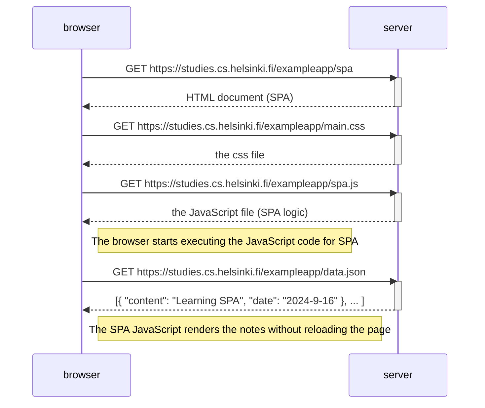

```mermaid	
sequenceDiagram;
    participant browser
    participant server

    browser->>server: GET https://studies.cs.helsinki.fi/exampleapp/spa
    activate server
    server-->>browser: HTML document (SPA)
    deactivate server

    browser->>server: GET https://studies.cs.helsinki.fi/exampleapp/main.css
    activate server
    server-->>browser: the css file
    deactivate server

    browser->>server: GET https://studies.cs.helsinki.fi/exampleapp/spa.js
    activate server
    server-->>browser: the JavaScript file (SPA logic)
    deactivate server

    Note right of browser: The browser starts executing the JavaScript code for SPA

    browser->>server: GET https://studies.cs.helsinki.fi/exampleapp/data.json
    activate server
    server-->>browser: [{ "content": "Learning SPA", "date": "2024-9-16" }, ... ]
    deactivate server

    Note right of browser: The SPA JavaScript renders the notes without reloading the page
```