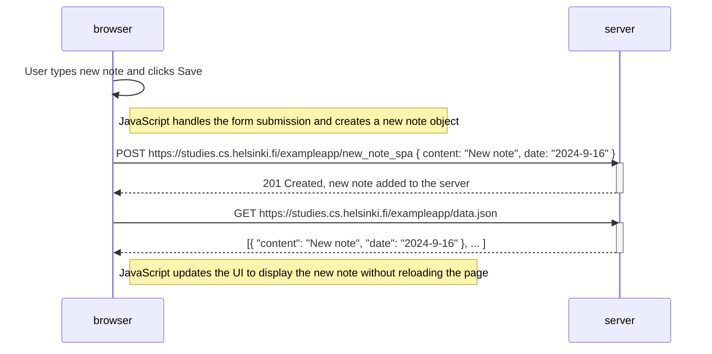

```mermaid	
sequenceDiagram;
    participant browser
    participant server

    browser->>browser: User types new note and clicks Save
    Note right of browser: JavaScript handles the form submission and creates a new note object

    browser->>server: POST https://studies.cs.helsinki.fi/exampleapp/new_note_spa { content: "New note", date: "2024-9-16" }
    activate server
    server-->>browser: 201 Created, new note added to the server
    deactivate server

    browser->>server: GET https://studies.cs.helsinki.fi/exampleapp/data.json
    activate server
    server-->>browser: [{ "content": "New note", "date": "2024-9-16" }, ... ]
    deactivate server

    Note right of browser: JavaScript updates the UI to display the new note without reloading the page
```