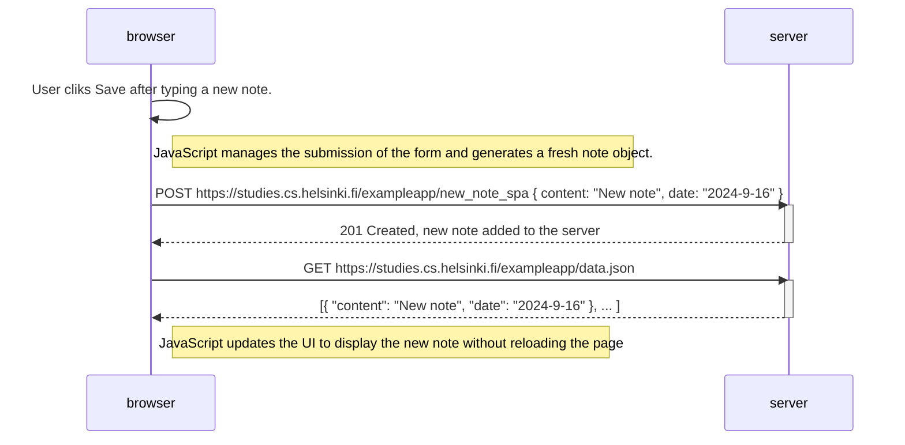

```mermaid	
sequenceDiagram;
    participant browser
    participant server

    browser->>browser: User cliks Save after typing a new note.
    Note right of browser: JavaScript manages the submission of the form and generates a fresh note object.

    browser->>server: POST https://studies.cs.helsinki.fi/exampleapp/new_note_spa { content: "New note", date: "2024-9-16" }
    activate server
    server-->>browser: 201 Created, new note added to the server
    deactivate server

    browser->>server: GET https://studies.cs.helsinki.fi/exampleapp/data.json
    activate server
    server-->>browser: [{ "content": "New note", "date": "2024-9-16" }, ... ]
    deactivate server

    Note right of browser: JavaScript updates the UI to display the new note without reloading the page
```